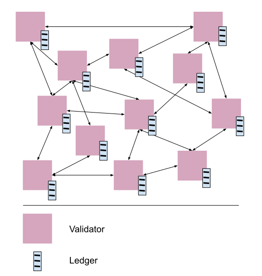
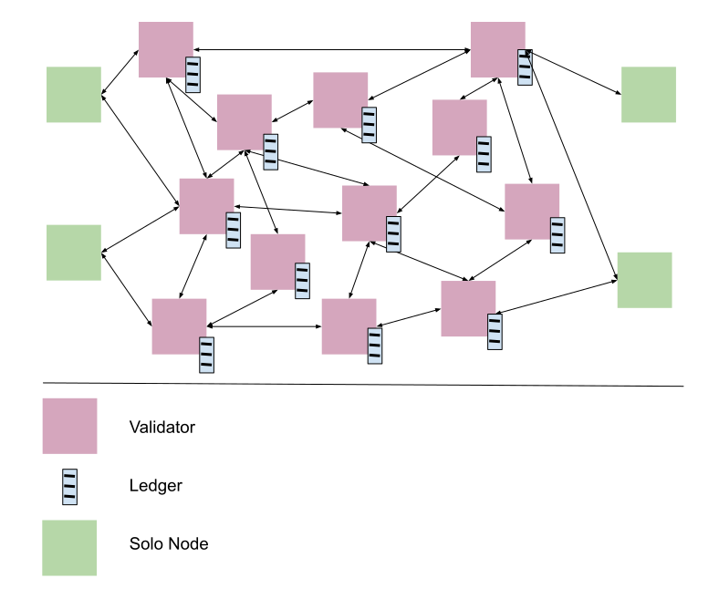
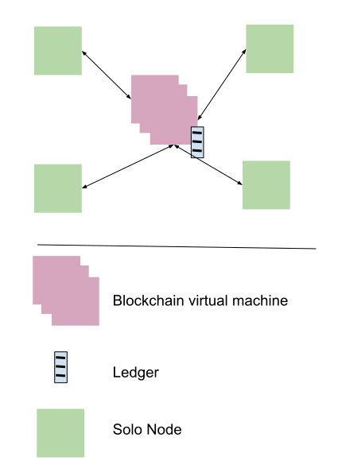
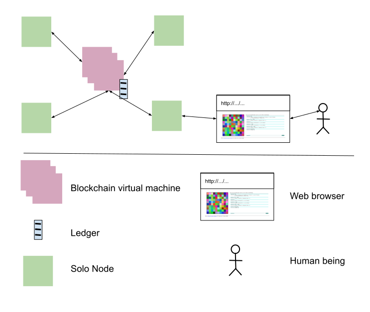

# Blockchain introduction

Cosmos already has a [great intro on blockchains](https://cosmos.network/intro) so you can start there
This page is more about how Agoric sees and uses blockchains

## A blockchain is like a machine

> a blockchain is a machine which state is made of consensus, not of silicon

(source?)

A blockchain can be described as a **digital ledger** maintained by a set of **validators**. Each square above is one of these **validators** (a physical machine) and each has its own copy of the **ledger**

The blockchain network acts like a single virtual machine

## Communicating with this machine

### Solo node

[Cosmic SwingSet](https://github.com/Agoric/cosmic-swingset) allows to build a **solo node**. This solo node can communicate with the rest of the blockchain network and add transactions to it.

(TODO: Do they have their own copy of the ledger as well?)

Since all the purple nodes are aimed at being the same machine, this virtual machine will be now drawn as a stack of purples

A solo node is usually related to the identity of a **single user**. The user has an **interface** to communicate with this solo node

