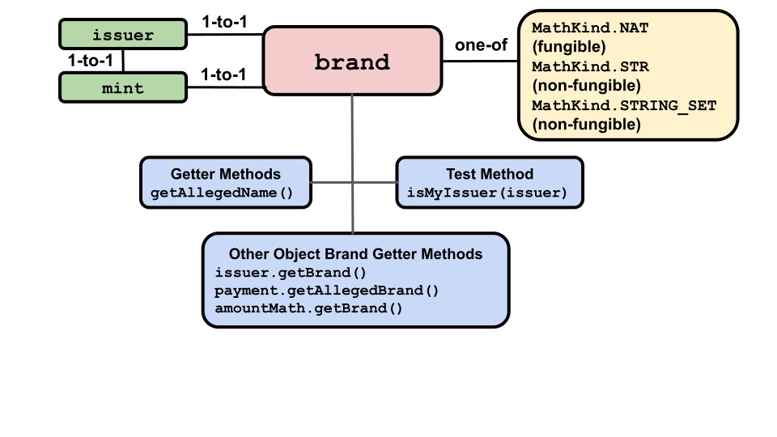

# Amounts, Values, and Brands

## Amounts

<router-link to="./assets/amount.svg">Amount methods</router-link>
Amounts describe digital assets. There are no `amount` API methods.
Instead, an `amount` has two properties, `value` and `brand` with their own API methods.
Use the `amountMath` API methods (covered in-depth 
<router-link to="./AmountMath.html">here</router-link>)
to get information about and otherwise manipulate an `amount` as a whole.

`amount` has two properties:
- **Brand**: The kind of digital asset, such as our imaginary `Quatloos` currency or,
  in a game, a powerful magic sword with a brand of `Plus3Sword-ABCGames` or similar.
- **Value**: How much/many of the asset. Fungible values are natural
numbers. Non-fungible values may be represented as strings naming a
particular right, or an arbitrary object representing the rights at
issue (e.g., a theatre ticket's date, time, row and seat positions).

`amounts` and their `values` and `brands` are manipulated by
the `AmountMath`
API. It executes the logic of how `amounts` change when digital 
assets are merged, separated, or otherwise manipulated. For example, 
you make an offer for something, which is declined. You want to change your 
offer, represented as an `amount`, to be of a greater `value` by adding to it.


**Note**: Prior to July 2020, Agoric exposed the `mathHelpers` object
type, and users referred to the three kinds of
`mathHelpers` and `mathHelpersName`. `mathHelpers` and its methods
were no longer used by contract developers, their methods being
subsumed by `amountMath` methods. References to `mathHelpersName` were
changed to `amountMathKind` and the `mathHelpers` methods were deprecated.

## Brands

 

A `brand` object is an `amount` object's kind of digital asset, such as
our imaginary quatloos currency or, in a game, a powerful magic
sword.

In ERTP, `mint` objects create new asset `payment`
objects. Each `mint` has a one-to-one relationship with an `issuer`
object. And each `issuer` object has a one-to-one
relationship with a `brand` object. This means:
- A `mint` can only create a `payment` for one specific `brand`, which
  must be the same `brand` as their associated `issuer`.
- An `issuer` can only create a new empty `purse` 
for one specific `brand`.
- An `amount` is either *fungible* or *non-fungible*, as determined by which
its `issuer`, and thus its `brand`, was created to be. 

A `brand` has two associated methods:
- [`brand.isMyIssuer(issuer)`](https://agoric.com/documentation/ertp/api/brand.html#brand-ismyissuer-issuer)
  - Returns `true` if the `issuer` argument matches the `issuer` associated with the `brand`.
    We have this method because the `issuer` is authoritative and the `brand` is not. You can
    create a `payment`, `purse`, or `amount` with a `brand` that claims a particular `issuer`,
    without that `issuer` having been involved. But if you use that `payment` or `purse`, it won't be 
    accepted by genuine ones. So to know, you have to verify with the `issuer` to see if it agrees
  - ```js
    const isIssuer = brand.isMyIssuer(issuer);
    ```
- [`brand.getAllegedName()`](https://agoric.com/documentation/ertp/api/brand.html#brand-getallegedname)
  - Return the `brand`'s alleged name, but should not be trusted as accurate.
  - ```js
    const name = brand.getAllegedName();
    ```

The following methods on other ERTP components also either operate on or
return a `brand`.

- [`issuer.getBrand()`](https://agoric.com/documentation/ertp/api/issuer.html#issuer-getBrand)
  - Returns the `brand` for the `issuer`. The `brand` is not closely
    held, so this should not be trusted to identify an `issuer`
    alone. Fake digital assets and `amount`s can use the `brand` of another `issuer`.
  - ```js
    const { quatloosIssuer, quatloosBrand } = makeIssuerKit('quatloos');
    const brand = quatloosIssuer.getBrand();
    // brand === quatloosBrand
    ```
- [`payment.getAllegedBrand()`](https://agoric.com/documentation/ertp/api/payment.html#payment-getallegedbrand)
  - Return the `payment`s alleged `brand`. Because a `payment`
  is not trusted, this should be treated with suspicion and verified
  elsewhere. This example code determines if a `payment` we got from untrusted sources
  is valid. It uses the `brand` to find a `purse` we want to deposit it in, then verifies
  that it's genuine.
  - ```js
    function depositSomewhere(payment) {
      const allegedBrand = payment.getAllegedBrand();
      const probablyAppropriatePurse = brandToPurse.get(allegedBrand);
      if (allegedBrand === probablyAppropriatePurse.getAllegedBrand()) {
         probablyAppropriatePurse.deposit(payment);
      }
    }  
    ```
- [`amountMath.getBrand()`](https://agoric.com/documentation/ertp/api/amount-math.html#amountmath-getbrand)
  - Return the `brand` the `amountMath` object is using for its
  methods.
  - ```js
    const { issuer } = makeIssuerKit('quatloos');
    const exampleAmountMath = quatloosIssuer.getAmountMath();
    const exampleBrand = exampleAmountMath.getBrand();
    ```

## Values

 

Values are the "how many" part of an `amount`. There are no `value`
methods, but two `amountMath` methods use or return them. 
- <router-link to="./api/amount-math.html#amountmath-getvalue-amount">`amountMath.getValue(amount)`</router-link>
  - Return the `amount` argument's `value`
  - ```js
    const { quatloosAmountMath } = makeIssuerKit('quatloos');
    const quatloos123 = quatloosAmountMath.make(123);
    // returns 123
    const value = quatloosAmountMath.getValue(quatloos123);
    ```
- <router-link to="./api/amount-math.html#amount-math-make-allegedvalue">`amountMath.make(allegedValue)`</router-link>
  - Make an `amount`from a `value` by adding the
  `amountMath` associated `brand` to the `value`. 
  - ```js
    const { quatloosAmountMath } = makeIssuerKit('quatloos');
    const quatloos837 = quatloosAmountMath.make(837);
    ```
