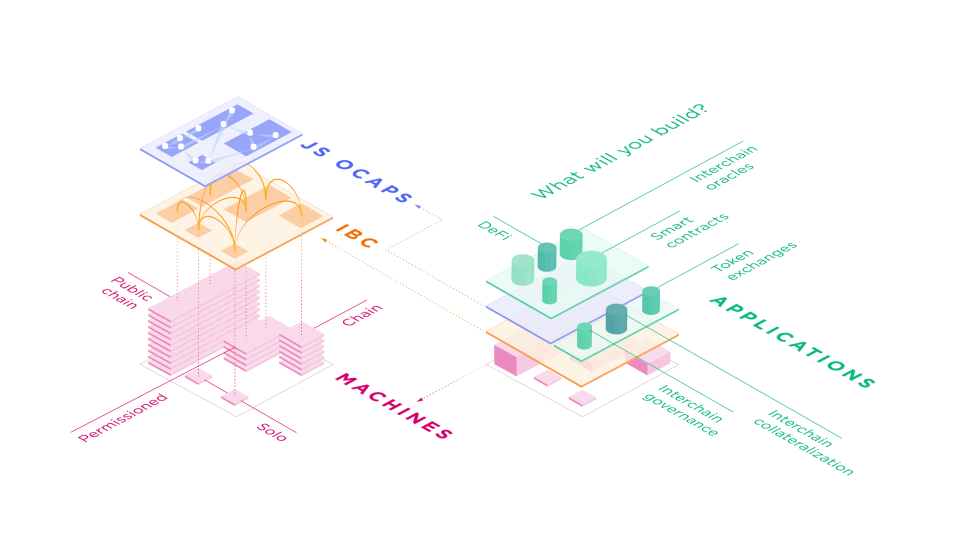

# Getting Started with the Agoric CLI



This tutorial will show you how to:
1) __Write smart contracts on Zoe, the Agoric platform.__

   Our pre-made contracts that you can copy include a Uniswap implementation
   (called autoswap), a second-price auction, and a simple exchange
   with an order book.

2) __Create dapp user interfaces that interact with the smart contracts
   and the user wallet.__

   Our pre-made UI that you can work with is the
   UI for autoswap, the Uniswap implementation.

Note that this environment does not connect to the Agoric testnet chain and
also does not create a local chain. We are working on adding the
ability to run contracts on chain to the Agoric CLI, but you can find
[more information on running on chain here](../manual-setup/README.md).


## Prerequisites

First, install [Node.js](http://nodejs.org/) (**version 10.16.0 or above**), and [Yarn 1](https://classic.yarnpkg.com/en/docs/install).

For now, you will need to set up the Agoric CLI as part of a checked-out Agoric SDK.  Run:

```sh
# Get the latest Agoric SDK in the agoric-sdk directory.
git clone https://github.com/Agoric/agoric-sdk
# Change to the agoric-sdk directory.
cd agoric-sdk
# Install NPM dependencies.
yarn install
# Build sources that need compiling.
yarn build
# You can install the agoric CLI anywhere in your $PATH,
# here is how to do it as /usr/local/bin/agoric
yarn link-cli /usr/local/bin/agoric
```


## Your First Agoric Dapp


In this guide, we're installing, running and interacting with the default smart contracts and UI.

TODO: define/explain the various parts


### Initialize the Dapp code

For now, you have to **stay in the `agoric-sdk` directory**. This is a [known limitation](https://github.com/Agoric/agoric-sdk/issues/570) that will be fixed.

```sh
# Initialize your dapp project.
# Note: Change the `demo` name to something meaningful.
agoric init demo
# `init` creates a folder with the name you specify and copies over all
# the files you might need.

# Go to its directory.
cd demo

# Install Javascript dependencies.
agoric install
```


### Start the local Agoric Node, wallet server and Dapp Server

This is all done in one command

```sh
# Run the local vat machine.
agoric start
```

Keep this terminal open somewhere

You can now open
- [http://localhost:3000](http://localhost:3000) to see our demo DApp
- [http://localhost:8000/wallet](http://localhost:8000/wallet) to see the Simple Wallet
- [http://localhost:8000/](http://localhost:8000/) to see your REPL (Read-Eval-Print Loop)


### Installing a contract

In a new terminal:

```sh
# make sure you're in the 'demo' directory

# Install your smart contract and web api (can be done separately)
agoric deploy ./contract/deploy.js ./api/deploy.js
```

TOCLARIFY: why those 2 files?
What does each refer to?
What is the benefit of deploying together or separately?


And navigate to our wallet
[http://localhost:8000/wallet/](http://localhost:8000/wallet/)

TOCLARIFY: what is the user supposed to see/noticed/understand with this step?
They deployed a contract. Who are the parties of this contract? Does the user play one or both roles (or none)?


### Launching a demo DApp server

Now let's start up the Autoswap frontend, our demo DApp:

```sh
cd ui
yarn install
yarn start  
```

This launches the React development server and opens a tab in your default browser, and will allow you to
trade using the autoswap front-end and contract. We've given you a few
purses to use in your trades.

## Writing a smart contract

Ready to write your own? We've given you a stripped down version of
the autoswap contract to get you started. It currently allows you to
trade 1 moola for 1 simolean and vice versa, but you can add more
functionality and redeploy.


If you take a look at the `demo` folder that you had just created,
you should see folders like:

* api
* contract
* ui

Go ahead and open up `contract/myFirstDapp.js`. To learn more about
writing a smart contract on Zoe, please see the [Zoe
guide](../zoe/guide/).

Once you've made changes to the smart contract, deploy:

```sh
# Redeploy
agoric deploy ./contract/deploy-myfirstdapp.js ./api/deploy.js
```

## Editing the demo DAppp


All of the code for the demo DAppp is under `/ui`. Once  changes
will automatically propagate to the browser tab.

Happy hacking!
