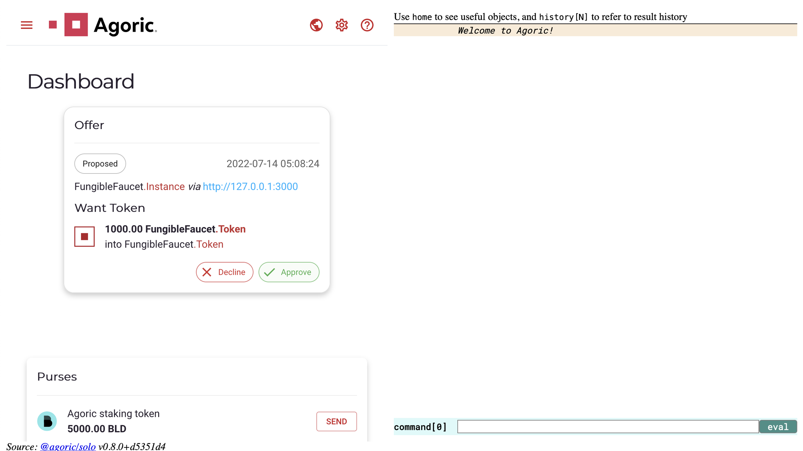

# Starting a Project

::: tip Beta status
The Agoric platform is at the beta stage. It is in the process of being formally evaluated for vulnerabilities, and is undergoing security treatment and hardening to support mainnet-1 launch. Do not use for production purposes. 
:::

Now that you have [installed the Agoric SDK](/getting-started/before-using-agoric.md),
let's try out your first Agoric _Dapp_ (decentralized application).

We'll be running **three terminal windows**, and
[dapp template initialization](#initialize-demo-from-dapp-template) in the first
window will create their shared working directory.


 1. ```sh
    # Terminal 1: simulated blockchain and "solo" client
    ```
 2. ```sh secondary style2
    # Terminal 2: contract interaction
    ```
 3. ```sh secondary style3
    # Terminal 3: web user interface
    ```

::: tip Watch: Prepare Your Agoric Environment (November 2020)
This presentation includes starting a project, but note an outdated detail:

 - In the REPL `x~.go()` tildot support has been postponed; use `E(x).go()`.

<iframe width="560" height="315" src="https://www.youtube.com/embed/w0By22jYhJA" title="YouTube video player" frameborder="0" allow="accelerometer; autoplay; clipboard-write; encrypted-media; gyroscope; picture-in-picture" allowfullscreen></iframe>
:::

## Initialize `demo` from Dapp Template

Use the [Agoric CLI](/guides/agoric-cli/commands.md) to fetch from a Dapp template
and put it in a `demo` directory _not located in your `agoric-sdk` clone_:


```sh
# Terminal 1
# Don't use your agoric-sdk clone as the parent of the demo directory.
# It doesn't have to be your home directory; any other directory will do.
cd $HOME
agoric init demo
```

The name `demo` is an arbitrary suggestion; in general,
use `agoric init $DIRNAME` with any name you like.

The default template is the [Fungible Faucet Dapp](https://github.com/Agoric/dapp-fungible-faucet).
Learn more about the [available dapp templates](/dapps/dapp-templates.md).

### Install the Agoric SDK in the Dapp

```sh
# Terminal 1
cd demo
agoric install
```

It may take a minute or so to install all the dependencies.

::: tip Mac Dev Tools
On a Mac, you must first install
[Xcode](https://apps.apple.com/us/app/xcode/id497799835)
:::

## Start the Agoric Solo Client and Simulated Blockchain

```sh
# Terminal 1
cd demo # if not already there
agoric start

# if the process was interrupted or crashed
# rerun the command above and it should resume

# to reset and start over
agoric start --reset
```

Leave this process and its logs running in its own terminal window.
## Deploy the Contract and API

In a separate terminal, deploy the contract to the simulated blockchain
and the API to the solo client.

```sh secondary style2
# Terminal 2
cd demo # if not already there
agoric deploy ./contract/deploy.js ./api/deploy.js
```

We'll cover [deploying smart contracts](/getting-started/deploying.md)
in detail later.

## Open the Agoric Wallet and REPL

```sh secondary style2
# Terminal 2
cd demo # if not already there
agoric open --repl
```

This should automatically open [http://127.0.0.1:8000](http://127.0.0.1:8000) in a new browser window or tab.

To begin using the wallet, click the "Connect Solo Wallet" button.


## Start the Dapp User Interface

The web user interface communicates with the API in the solo client as well as the wallet.

```sh secondary style3
# Terminal 3
cd demo # if not already there
cd ui && yarn start
```

Leave this running in its own terminal window and visit [http://localhost:3000](http://localhost:3000) in a web browser.

Once here, you will be asked to enable the dapp in your Agoric wallet.


## Connect the Dapp to the Agoric Wallet

Navigate back to [http://127.0.0.1:8000](http://127.0.0.1:8000) and accept the Dapp's request to connect to your wallet.


Navigating to the "Dapps" section of the Agoric Wallet should now show that you have successfully connected.


## Use the Dapp to collect your (simulated) tokens

Once your wallet has been connected, return to [http://localhost:3000](http://localhost:3000) and click the "Mint Fungible Tokens" button.


Navigate back to [http://127.0.0.1:8000](http://127.0.0.1:8000) to approve the offer and collect the tokens.



Your wallet's FungibleFaucet purse will now hold 1000 FungibleFaucet tokens.


Visit the documentation's [wallet UI](/guides/wallet/ui.md#wallet-ui) section to learn more.