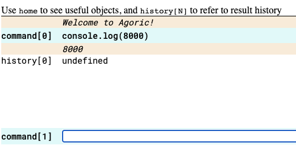
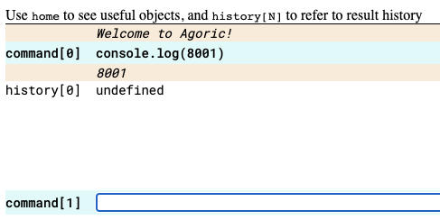

# Starting Multiuser Dapps

When developing a dapp, you may need to test how it behaves with multiple users before deploying it publicly. These users could have different roles, such as the contract deployer, an auctioneer, a bidder, a buyer, a seller, etc.

The Agoric CLI (Command Line Interface) implements a local-chain-multiuser scenario for developing and testing multiuser dapps.

## Usage

1. Initialize your dapp as described in the [Starting a Project](../getting-started/) documentation.
2. After using `agoric start` to test with the simulated chain, stop the simulated chain with Control-C.
3. Compile the Golang dependencies in the Agoric SDK by running

   ```sh
   cd agoric-sdk/packages/cosmic-swingset && make
   ```

4. Check that the `agd` binary is in your `$PATH` by running the following.

   ```sh
   # Display the directory that should be in your $PATH.
   echo ${GOBIN-${GOPATH-$HOME/go}/bin}
   # Attempt to run a binary that was installed there.
   agd version --long
   ```

   (If the binary doesn't work, you need to add it to your `$PATH`.)

5. Start a real local chain by running the following command. If you want to start the Agoric process afresh, add the `--reset` option at the end.

   ```sh
   agoric start local-chain --rebuild
   ```

There won’t be any running clients yet, but the chain will start and be fully functional.

You'll want to run the chain in the background, so you must know how to manage background processes on your system. For example, Unix-like systems can use the following to start an Agoric process in the background and log it to _chain.log_.

```sh
agoric start local-chain >& chain.log &
```

To start a local solo machine connected to the above local chain (i.e., your API ag-solo), run the following.

```sh
agoric start local-solo 8000
```

Note that this should either give an error or take a long time (i.e., over a minute), during which your local chain should be logging something like `validTxs=1`. There are over 50 round trips (at 2 seconds apiece) before the local ag-solo is ready to use.

This starts a solo machine listening for HTTP on TCP port 8000.

To start other local ag-solos, use a unique port number for each one (e.g., 8001 or 8002).

```sh
agoric start local-solo <PORT-NUMBER>
```

For each new local ag-solo, you need to either:

- Open the wallet corresponding to each local-solo port number by running:
  - `agoric open --hostport=localhost:<local-solo-portnumber>`
- Or open the wallet, get its displayed URL, and then copy/paste the URL into the browser you want to
  view the wallet in:
  - `agoric open --no-browser --hostport=localhost:<local-solo-portnumber>`

Test that each of your ag-solos is running and has a wallet by connecting to `http://localhost:<PORT-NUMBER>/` for each port you used.

Run your contract and API deployment scripts against the API ag-solo using the following command.

```sh
agoric deploy <PATH-TO-DEPLOY.JS>
```

Note that port 8000 is the default for `agoric deploy` operations. To deploy to an ag-solo running on a different port, use `agoric deploy --hostport=127.0.0.1:<PORT-NUMBER>`.

To use your dapp UI with different clients, you’ll need to connect to https://wallet.agoric.app/locator/ in different browsers (or different profiles of the same browser). You'll then need to fill out the localhost address of the ag-solo that you want to use with that browser. This connects the processes in the browser to their own wallets so they do not share per-client data such as cookies, storage, etc. You should test your UI in each browser.

## Example

Here is an example usage scenario.

1. Start the local chain and ag-solos.

   ```sh
   # Build the Golang dependencies.
   (cd agoric-sdk/packages/cosmic-swingset && make)
   # Check that agd binary is in your $PATH and working
   agd version --long
   # Initialize a Dapp directory.
   agoric init foo
   # Change to the Dapp directory.
   cd foo
   # Install NPM dependencies.
   agoric install
   # Start the local chain, logging to chain.log.
   agoric start local-chain >& chain.log &
   # Start a local API ag-solo (takes over a minute to finish)
   agoric start local-solo 8000 >& solo-8000.log &
   # Open the associated wallet
   agoric open --hostport=localhost:8000
   # Start a second ag-solo.
   agoric start local-solo 8001 >& solo-8001.log &
   # Open the second associated wallet
   agoric open --hostport=localhost:8001
   # Repeat for any other ag-solos you wish to start (8002, 8003, etc)
   ```

2. Configure the first client browser.
3. Open a browser (or a new profile), and navigate to https://wallet.agoric.app/locator/.

   

4. Keep the recommended address (`http://localhost:8000`).
5. Click **Open** and verify that it opens a wallet and REPL (Read-Eval-Print-Loop).
6. In the REPL, type `console.log(8000)`.
7. Hit **Enter**, and see the command and output in the REPL history.

   

### Configure an Additional Client Browser

1. Open a different browser. Not just another tab or window, but a completely different browser or browser profile that doesn’t share cookies with any other ag-solo’s browser. For example, if you had an open Chrome window, create a new Chrome profile, or open a Firefox or Safari window.
2. Navigate to `https://wallet.agoric.app/locator/` and, in the resulting page, set the address to `http://localhost:8001`.
3. Click **Save**.
4. Click **Open** and verify that it opens a wallet page. (**Note**: You won't have access yet.)
5. Type `console.log(8001)` in the REPL, hit **Enter**, and see the `console.log` command and output in the REPL's history.

   

You can repeat this section for as many other ports as you ran ag-solos for.

### Test the UI

```sh
# Deploy the contract and API service.
agoric deploy contract/deploy.js api/deploy.js
# Start the UI
(cd ui && yarn start)
```

Navigate to `http://localhost:3000` in each browser/profile for which you want to use the UI.  
When the UI opens your wallet, the browser should navigate to the same URL you entered in that browser
or profile’s `https://wallet.agoric.app/locator/` page.
