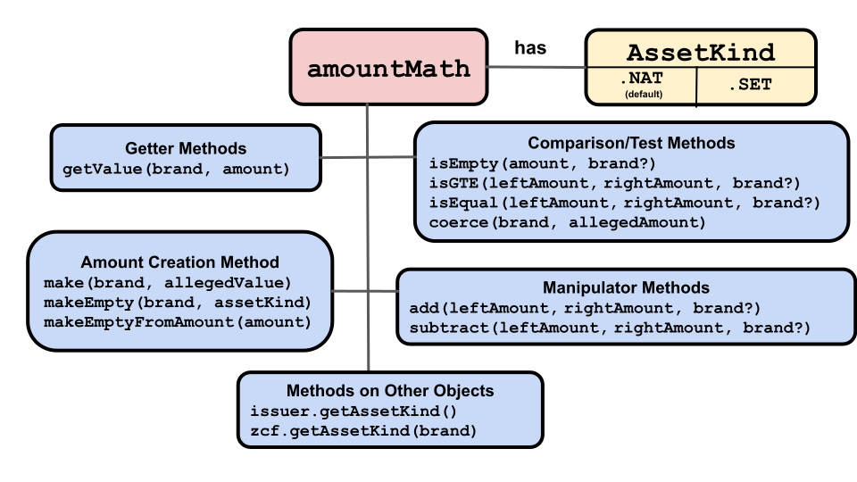

# AmountMath

 

Depositing and withdrawing assets from a
`purse` and manipulating `payment` amounts 
all require adding and subtracting digital assets.
ERTP uses the `AmountMath` library for all these operations. 

The `AmountMath` library functions work for both fungible and nonfungible tokens. 
There are two `AssetKinds`, each of which implements the same methods. Which kind is used 
for a particular `brand` depends on what was specified when the `brand` and 
its `issuer` were created. They are: 
- `AssetKind.NAT` ("nat"): Used with fungible assets. Values are natural numbers using the JavaScript [BigInt](https://developer.mozilla.org/en-US/docs/Web/JavaScript/Reference/Global_Objects/BigInt) type to avoid overflow risks from using the usual JavaScript `Number` type.
- `AssetKind.SET` ("set"): Used with non-fungible assets. Values are [copyArray](../js-programming/far.md#passstyleof-api)s such as hardened arrays of strings.

## AmountMath Methods
The following is a brief description and example of each `AmountMath` method. For
more detail, click the method's name to go to its entry in the [ERTP
API Reference](/reference/ertp-api/).

Note that many methods have a `brand` argument, either required or
optional. Where optional, use the `brand` you got from an issuer (or from Zoe)
to add verification that the `brand` of "amount" argument(s) corresponds with that `brand`.

- **Information Getting Methods**
  - [AmountMath.getValue(brand, amount)](/reference/ertp-api/amount-math.md#amountmath-getvalue-brand-amount)
    - Returns the `value` of the `amount` argument. For fungible assets, this will be a `BigInt`.
    - <<< @/../snippets/ertp/guide/test-amount-math.js#getValue
- **Comparison Methods**
  - [AmountMath.isEmpty(amount, brand?)](/reference/ertp-api/amount-math.md#amountmath-isempty-amount-brand)
    - Returns `true` if its `amount` argument is empty, otherwise `false`.
      Throws an error if the optional `brand` argument isn't the same as the `amount` argument brand.
    - <<< @/../snippets/ertp/guide/test-amount-math.js#isEmpty
  - [AmountMath.isGTE(leftAmount, rightAmount, brand?)](/reference/ertp-api/amount-math.md#amountmath-isgte-leftamount-rightamount-brand)
    - Returns `true` if the `leftAmount` argument is greater than or equal
      to the `rightAmount` argument, otherwise `false`.
      Throws an error if the optional `brand` argument isn't the same as the `amount` arguments brands.
    - <<< @/../snippets/ertp/guide/test-amount-math.js#isGTE
  - [AmountMath.isEqual(leftAmount, rightAmount, brand?)](/reference/ertp-api/amount-math.md#amountmath-isequal-leftamount-rightamount-brand)
    - Returns `true` if the `leftAmount` argument equals the
      `rightAmount` argument. Throws an error if the optional `brand` argument isn't the same as the `amount` arguments brands.
    - <<< @/../snippets/ertp/guide/test-amount-math.js#isEqual
  - [AmountMath.coerce(brand, allegedAmount)](/reference/ertp-api/amount-math.md#amountmath-coerce-brand-allegedamount)
    - Takes an `amount` and returns it if it's a valid `amount`.
      If invalid, it throws an error.
    - <<< @/../snippets/ertp/guide/test-amount-math.js#coerce
- **Manipulator Methods**
  - [AmountMath.add(leftAmount, rightAmount, brand?)](/reference/ertp-api/amount-math.md#amountmath-add-leftamount-rightamount-brand)
    - Returns an `amount` that is the union of the `leftAmount` and `rightAmount`
      `amount` arguments. For a fungible `amount`, this means add their
      values.  For a non-fungible `amount`, it usually means
      including all elements from both `leftAmount` and `rightAmount`.
      Throws an error if the optional `brand` argument isn't the same as the `amount` arguments brands.
    - <<< @/../snippets/ertp/guide/test-amount-math.js#add
  - [AmountMath.subtract(leftAmount, rightAmount, brand?)](/reference/ertp-api/amount-math.md#amountmath-subtract-leftamount-rightamount-brand)
    - Returns a new `amount` that is the `leftAmount` argument minus
      the `rightAmount` argument (i.e., for strings or objects
      everything in `leftAmount` not in `rightAmount`). If `leftAmount`
      doesn't include the contents of `rightAmount`, it throws an error. 
      It also throws an error if the optional `brand` argument isn't the 
      same as the `amount` arguments brands.
    - <<< @/../snippets/ertp/guide/test-amount-math.js#subtract
- **Amount Creation Methods**
  - [AmountMath.make(brand, allegedValue)](/reference/ertp-api/amount-math.md#amountmath-make-brand-allegedvalue)	
    - Takes a `value` argument and returns an `amount` by making a record
      with the `value` and the `brand` associated with the `AmountMath`. The `value`
      argument should be represented as a `BigInt` e.g. `10n` rather than `10`.
    - <<< @/../snippets/ertp/guide/test-amount-math.js#make
  - [AmountMath.makeEmpty(brand, assetKind)](/reference/ertp-api/amount-math.md#amountmath-makeempty-brand-assetkind)
    - Returns an `amount` representing an empty `amount`, which is the identity
      element for the `AmountMath` `add()` and `subtract()`
      operations. Note that this value varies depending on the
      `brand` and whether it is of kind `AssetKind.NAT` or `AssetKind.SET`.
    - <<< @/../snippets/ertp/guide/test-amount-math.js#makeEmpty
  - [AmountMath.makeEmptyFromAmount(amount)](/reference/ertp-api/amount-math.md#amountmath-makeemptyfromamount-amount)
    - Returns an `amount` representing an empty `amount`, using another `amount`
      as the template for the new empty amount's `brand` and `assetKind`.
    - <<< @/../snippets/ertp/guide/test-amount-math.js#makeEmptyFromAmount
 
## Methods On Other Objects

These methods return an **[AssetKind](/reference/ertp-api/ertp-data-types.md#assetkind)**: 
- [anIssuer.getAssetKind()](/reference/ertp-api/issuer.md#anissuer-getassetkind)
  - Returns the `AssetKind` of the `issuer`'s `brand`. (`AssetKind.NAT` or `AssetKind.SET`).
  - <<< @/../snippets/ertp/guide/test-amount-math.js#getAssetKind2
- [zcf.getAssetKind(brand)](/reference/zoe-api/zoe-contract-facet.md#zcf-getassetkind-brand)
  - Returns the `AssetKind` of the `brand` argument. 
  - <<< @/../snippets/ertp/guide/test-amount-math.js#zcfGetAssetKind
