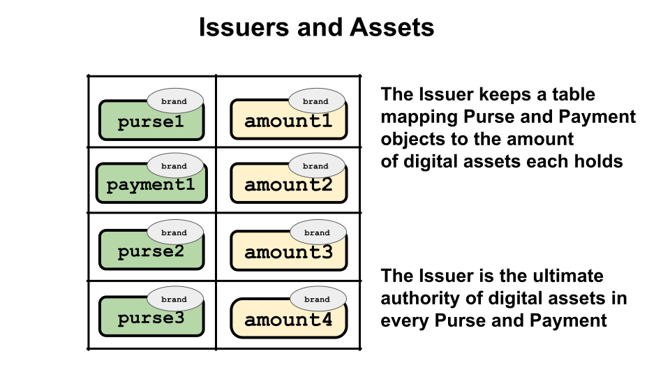
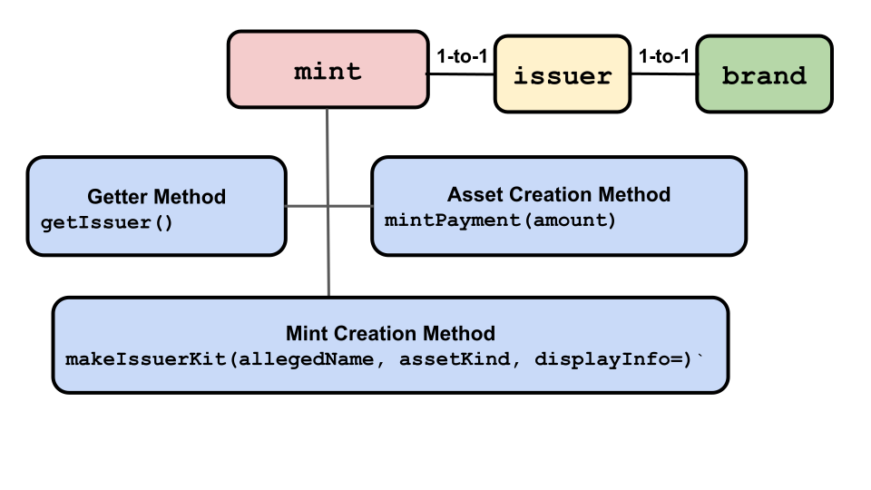

# Issuers and  Mints

## Issuers

**Note**: You should not create an **[Issuer](/reference/ertp-api/issuer.md)** in a deploy script. Deploy scripts are ephemeral, so any object 
created there dies as soon as the script stops.

Behind the scenes, an **Issuer** maps minted digital assets to their location in a **[Purse](/reference/ertp-api/purse.md)**
or **[Payment](/reference/ertp-api/payment.md)**. An **Issuer** verifies, moves, and manipulates digital assets. 
Its special admin facet is a **[Mint](/reference/ertp-api/mint.md)** which it has a one-to-one
relationship with. Only a **Mint** can issue new digital assets; an **Issuer** cannot.

An **Issuer** also has a one-to-one relationship with a **[Brand](/reference/ertp-api/brand.md)**. So, if
our **Brand** is the imaginary currency *Quatloos*, only
the **Issuer** in the one-to-one relationship with the *Quatloos* **Brand**
can:
- Create a new empty **Purse** that can store *Quatloos*.
- Manipulate a **Payment** in *Quatloos* to be claimed, split, combined,
burned, or have its amount received.

An **Issuer** should be obtained from a trusted source and
then relied upon as the authority as to whether an untrusted **Payment**
of the same **Brand** is valid.
 

**Issuer** methods:
- Return information about an **Issuer**.
- Create new **Issuers**.
- Create new **Purses**. 
- Operate on **Payment** arguments.

The following is
a brief description of each **Issuer** method.

- **Create Issuer operation**
  - [makeIssuerKit()](/reference/ertp-api/issuer.md#makeissuerkit-allegedname-assetkind-displayinfo-optshutdownwithfailure-elementshape)
    - Creates and returns a new **Issuer**  and its associated **Mint** and **Brand**.
    - <<< @/snippets/ertp/guide/test-issuers-and-mints.js#import
      <<< @/snippets/ertp/guide/test-issuers-and-mints.js#makeIssuerKit
- **Get information about the Issuer operations**
  - [anIssuer.getAllegedName()](/reference/ertp-api/issuer.md#anissuer-getallegedname)
    - Returns the **allegedName** for the **Issuer** (i.e., the non-trusted human-readable name of its associated **Brand**).
    - <<< @/snippets/ertp/guide/test-issuers-and-mints.js#getAllegedName
  - [anIssuer.getAssetKind()](/reference/ertp-api/issuer.md#anissuer-getassetkind)
    - Returns the **[AssetKind](/reference/ertp-api/ertp-data-types.md#assetkind)** of the **Issuer**'s asset.
    - <<< @/snippets/ertp/guide/test-issuers-and-mints.js#getAssetKind
  - [anIssuer.getBrand()](/reference/ertp-api/issuer.md#anissuer-getbrand)
    - Returns the **Brand** associated with the **Issuer**.
    - <<< @/snippets/ertp/guide/test-issuers-and-mints.js#getBrand
- **Purse operation**
  - [anIssuer.makeEmptyPurse()](/reference/ertp-api/issuer.md#anissuer-makeemptypurse)
    - Makes and returns an empty **Purse** for holding assets of the **Brand** associated with the **Issuer**.
    - <<< @/snippets/ertp/guide/test-issuers-and-mints.js#makeEmptyPurse
- **Payment operations**
  - [anIssuer.burn()](/reference/ertp-api/issuer.md#anissuer-burn-payment-optamount)
    - Destroys all of the digital assets in a **Payment**.
    - <<< @/snippets/ertp/guide/test-issuers-and-mints.js#burn
  - [anIssuer.claim()](/reference/ertp-api/issuer.md#anissuer-claim-payment-optamount)
    - Transfers all digital assets from a **Payment** to a new **Payment**.
    - <<< @/snippets/ertp/guide/test-issuers-and-mints.js#claim
  - [anIssuer.combine()](/reference/ertp-api/issuer.md#anissuer-combine-paymentsarray-opttotalamount)
    - Combines multiple **Payments** into one new **Payment**.
    - <<< @/snippets/ertp/guide/test-issuers-and-mints.js#combine
  - [anIssuer.getAmountOf()](/reference/ertp-api/issuer.md#anissuer-getamountof-payment)
    - Describes a **Payment**'s balance expressed as an **[Amount](/reference/ertp-api/ertp-data-types.md#amount)**.
    - <<< @/snippets/ertp/guide/test-issuers-and-mints.js#getAmountOf
  - [anIssuer.isLive()](/reference/ertp-api/issuer.md#anissuer-islive-payment)
    - Returns **true** if a **Payment** was created by the **Issuer** and is available for use (i.e., it hasn't been consumed or burned).
    - <<< @/snippets/ertp/guide/test-issuers-and-mints.js#isLive
  - [anIssuer.split()](/reference/ertp-api/issuer.md#anissuer-split-payment-paymentamounta)
    - Splits a single **Payment** into two new **Payments**.
    - <<< @/snippets/ertp/guide/test-issuers-and-mints.js#split
  - [anIssuer.splitMany(payment, paymentAmountArray)](/reference/ertp-api/issuer.md#anissuer-splitmany-payment-amountarray)
    - Splits a single **Payment** into multiple **Payments**x.
    - <<< @/snippets/ertp/guide/test-issuers-and-mints.js#splitMany

**Related Methods:**

**Note**: These methods help you find the right `issuer`, but aren't authoritative.
A `mint`, `brand`, or `purse` is actually associated with an `issuer` only if
the `issuer` itself acknowledges the association.

- [aMint.getIssuer()](/reference/ertp-api/mint.md#amint-getissuer)
  - Return the `issuer` uniquely associated with the `mint`.
  - <<< @/snippets/ertp/guide/test-issuers-and-mints.js#mintGetIssuer
- [aBrand.isMyIssuer(issuer)](/reference/ertp-api/brand.md#abrand-ismyissuer-allegedissuer)
  - Return `true` if `issuer` is the brand's `issuer`, `false` if not.
  - <<< @/snippets/ertp/guide/test-issuers-and-mints.js#isMyIssuer

## Mints

A **[Mint](/reference/ertp-api/mint.md)** issues new digital assets of its associated **[Brand](/reference/ertp-api/brand.md)** as a new 
**[Payment](/reference/ertp-api/payment.md)** object. These assets may be currency-like (e.g., our imaginary
*Quatloos* currency), goods-like valuables (e.g., magic swords for games), or
electronic rights (e.g., the right to participate in a contract). Only a
holder of a **Mint** object can create new assets from it. 

Since these relationships are one-to-one and unchangeable:
- A **Mint** created to make an asset **Brand** (e.g., *Quatloos*) can only create that **Brand** asset.
For example, only *Quatloos*, not *Moola* or anything else.
- A **Mint** that creates an asset **Brand** is the only **Mint** that can create that **Brand**. Only
the one *Quatloos* **Mint** can create new *Quatloos*.
- A **Mint** that creates an asset **Brand** can never be changed to create a different **Brand**.
Thus, a *Quatloos* **Mint** can never become a *Moola* **Mint**, or any other non-*Quatloos* asset.

There are two **Mint** methods.
- [aMint.getIssuer()](/reference/ertp-api/mint.md#amint-getissuer)
  - Returns the **[Issuer](/reference/ertp-api/issuer.md)** associated with the **Mint**.
  - <<< @/snippets/ertp/guide/test-issuers-and-mints.js#mintGetIssuer
- [aMint.mintPayment()](/reference/ertp-api/mint.md#amint-mintpayment-newamount)
  - Creates new digital assets of the **Mint**'s associated **Brand**.
  - <<< @/snippets/ertp/guide/test-issuers-and-mints.js#mintMintPayment

