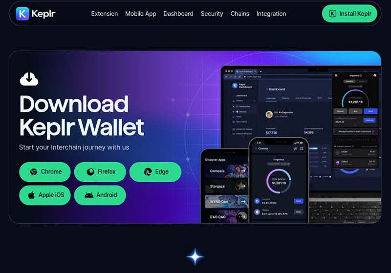
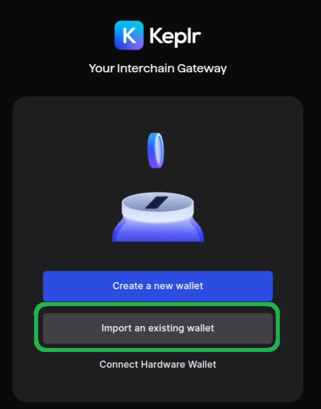
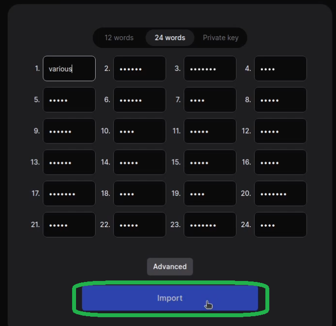
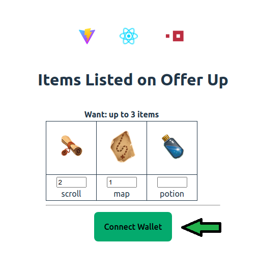
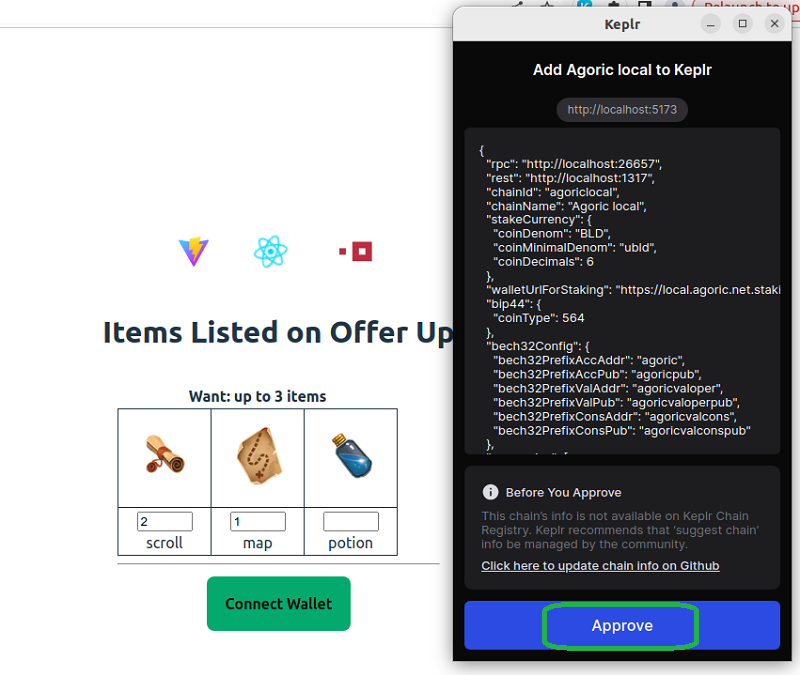
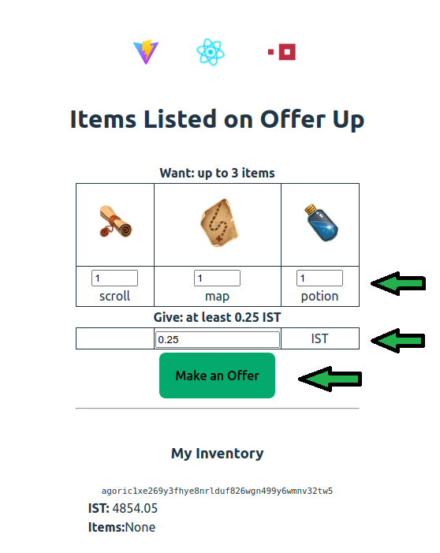

# Your First Agoric Dapp
In these steps you will be getting your first Agoric dapp up and running!


## How to Get Help
Before getting started, there are some resources you might want to keep handy in case you get stuck, have questions, or are curious about any of the components. Getting in contact with us is easy! 
- Join us for our Weekly [Developer Office Hours](https://github.com/Agoric/agoric-sdk/wiki/Office-Hours)
- Come chat with us and other developers on the Official [Agoric Discord](https://agoric.com/discord)
- Search and post [Q & A](https://github.com/Agoric/agoric-sdk/discussions/categories/q-a) in [agoric-sdk discussions](https://github.com/Agoric/agoric-sdk/discussions)
- Send us a message on [X](https://twitter.com/agoric)
- Send an Email to [Developer Relations](mailto://devrel@agoric.com)


## Platform Requirements
Currently Agoric supports [Windows Subsystem for Linux](https://learn.microsoft.com/en-us/windows/wsl/about), MacOS, and Linux. This tutorial is based on an installation of [Ubuntu 22.04 LTS](https://ubuntu.com/download/desktop). If you're using a different operating system, some variation may be required.

## Installing Prerequisites
In this section you'll be installing prerequisite components into your environment. If you're working with your own environment rather than using a fresh Ubuntu install, you may already have some or all of these components already installed.

### Installing Curl Utility on Ubuntu
<details>
<summary>Installing Curl Utility on Ubuntu</summary>

If you already have the `curl` utility installed, you can skip this section. Users running a freshly installed Linux environment will most likely need to run these steps to install `curl`.

If using Ubuntu you'll first need to run the command below to prevent an error when installing `curl`.

```sh
sudo apt-get update --fix-missing
```

Install the `curl` utility.

```sh
sudo apt install curl
```

</details>


### Installing NVM and Node
<details>
<summary>Installing NVM and Node on Ubuntu</summary>

At this point the Node Version Manager (NVM) utility will be installed. `nvm` makes it easy to select the specific version of [Node](https://nodejs.org/) that will be required for this tutorial (v18.16.0).

```sh
curl -o- https://raw.githubusercontent.com/nvm-sh/nvm/v0.39.7/install.sh | bash
```

Next, run the command:

```sh
source ~/.bashrc
```

Finally, install Node with the command:

```sh
nvm install v18.16.0
```
</details>


### Installing Yarn

<details>
<summary>Installing Yarn on Ubuntu</summary>
  
Run the `corepack enable` command.

```sh
corepack enable
```

Now run the `yarn --version` command.

```sh
yarn --version
```
</details>


### Installing Docker

<details>
<summary>Installing Docker on Ubuntu</summary>

Now you'll install Docker using the two steps below. This first block of commands will add the Docker GPG keys to your system, then add the repository to Apt for installation.

```sh
# Install Docker
# Add Docker's official GPG key:
sudo apt-get update
sudo apt-get install ca-certificates curl gnupg
sudo install -m 0755 -d /etc/apt/keyrings
curl -fsSL https://download.docker.com/linux/ubuntu/gpg | sudo gpg --dearmor -o /etc/apt/keyrings/docker.gpg
sudo chmod a+r /etc/apt/keyrings/docker.gpg

# Add the repository to Apt sources:
echo \
  "deb [arch=$(dpkg --print-architecture) signed-by=/etc/apt/keyrings/docker.gpg] https://download.docker.com/linux/ubuntu \
  $(. /etc/os-release && echo "$VERSION_CODENAME") stable" | \
  sudo tee /etc/apt/sources.list.d/docker.list > /dev/null
sudo apt-get update
```
Now you can install Docker!

```sh
sudo apt-get install docker-ce docker-ce-cli containerd.io docker-buildx-plugin docker-compose-plugin
```

Now that Docker has been installed you'll need to add your user account to the Docker group.

```sh
sudo usermod -aG docker $USER
```

Since your user account was just added to the docker group, run the following command to re-evaluate group memberships.

```sh
exec su -l $USER
```

Now test that Docker works by running the `hello-world` sample.

```sh
docker run hello-world
```

The output of the `hello-world` example should be:

```
Hello from Docker!
This message shows that your installation appears to be working correctly.

To generate this message, Docker took the following steps:
 1. The Docker client contacted the Docker daemon.
 2. The Docker daemon pulled the "hello-world" image from the Docker Hub.
    (amd64)
 3. The Docker daemon created a new container from that image which runs the
    executable that produces the output you are currently reading.
 4. The Docker daemon streamed that output to the Docker client, which sent it
    to your terminal.

To try something more ambitious, you can run an Ubuntu container with:
 $ docker run -it ubuntu bash

Share images, automate workflows, and more with a free Docker ID:
 https://hub.docker.com/

For more examples and ideas, visit:
 https://docs.docker.com/get-started/
```
</details>

## Installing the Sample Dapp
Now you'll use yarn to pull down the sample dapp. The sample dapp will be placed in a subfolder named `demo`.

```sh
yarn create @agoric/dapp --dapp-template dapp-offer-up demo
```


## Install Dapp Dependencies
Now navigate to the `demo` directory and run the `yarn install` command to install any solution dependencies.

Downloading all the required dependencies may take several minutes. The UI depends on the React framework, and the contract depends on the Agoric framework. The packages in this project also have development dependencies for testing, code formatting, and static analysis.

```sh
cd demo
```

```sh
yarn install
```

<details>
 <summary>Troubleshooting yarn install</summary>
  
 If you run into errors during `yarn install`, check that you are on a [supported platform](#platform-requirements) and not native Windows. 
  
 Then make sure you have the relevant developer tools installed. For example, on Debian or Ubuntu Linux, run `sudo apt get install build-essential`. 
 On MacOS, be sure to install [Xcode](https://apps.apple.com/us/app/xcode/id497799835). 
  
  </details>

## Starting a Local Agoric Blockchain
Now go ahead and start a local Agoric blockchain using the `yarn start` command. Note: This container is several gigabytes in size and may take a few minutes to download.

```sh
yarn start:docker
```

Once the network has started you can check the logs. Once you see messages showing blocks with a status of `commit` you can rest assured the network is running properly.

```sh
yarn docker:logs
```

Your output should resemble this:

```
demo-agd-1  | 2023-12-15T19:07:45.530Z block-manager: block 11797 begin
demo-agd-1  | 2023-12-15T19:07:45.534Z block-manager: block 11797 commit
demo-agd-1  | 2023-12-15T19:07:46.539Z block-manager: block 11798 begin
demo-agd-1  | 2023-12-15T19:07:46.543Z block-manager: block 11798 commit
demo-agd-1  | 2023-12-15T19:07:47.557Z block-manager: block 11799 begin
demo-agd-1  | 2023-12-15T19:07:47.560Z block-manager: block 11799 commit
demo-agd-1  | 2023-12-15T19:07:48.572Z block-manager: block 11800 begin
demo-agd-1  | 2023-12-15T19:07:48.577Z block-manager: block 11800 commit
demo-agd-1  | 2023-12-15T19:07:49.590Z block-manager: block 11801 begin
demo-agd-1  | 2023-12-15T19:07:49.593Z block-manager: block 11801 commit
demo-agd-1  | 2023-12-15T19:07:50.628Z block-manager: block 11802 begin
demo-agd-1  | 2023-12-15T19:07:50.633Z block-manager: block 11802 commit
demo-agd-1  | 2023-12-15T19:07:51.642Z block-manager: block 11803 begin
demo-agd-1  | 2023-12-15T19:07:51.645Z block-manager: block 11803 commit
demo-agd-1  | 2023-12-15T19:07:52.674Z block-manager: block 11804 begin
demo-agd-1  | 2023-12-15T19:07:52.678Z block-manager: block 11804 commit
demo-agd-1  | 2023-12-15T19:07:53.681Z block-manager: block 11805 begin
demo-agd-1  | 2023-12-15T19:07:53.685Z block-manager: block 11805 commit
demo-agd-1  | 2023-12-15T19:07:54.698Z block-manager: block 11806 begin
demo-agd-1  | 2023-12-15T19:07:54.702Z block-manager: block 11806 commit
```


## Starting the Dapp Smart Contract
Use control-C to exit the logs, then start the smart contract. Starting the contract may take a minute or two, so after running this command proceed to the next step.

```sh
yarn start:contract
```


## Installing Keplr Wallet
Next, you'll install the Keplr wallet plug-in. Open up your browser and navigate to [https://www.keplr.app/download](https://www.keplr.app/download). Select the version appropriate to your browser. 



Once the plug-in has been installed, open Keplr and select the option to "Import an existing wallet". Then choose the option to "Use recovery phrase or private key".




To import your wallet, you'll need to copy your mnemonic phrase into Keplr. You can find this series of 24 words back on your terminal window. Copy from this window into your Keplr wallet, then hit the "Import" button. 

Please note that your phrase might not be the same as the one shown in this guide! Remember, this is just a demo. In real-world scenarios ensuring proper security around mnemonic phrases is critical!
- For any mnemonic phrase you use to secure your own assets, **take care to keep it strictly confidential!** The mnemonic here is only for testing. 
- Using a **separate browser profile** is a good way to avoid accidentally using the wrong account when testing vs. with real assets. 

Note the mnemonic phrase in the output below:
```
waiting for block...
1
block produced
done
Waiting for proposal to pass (status=PROPOSAL_STATUS_VOTING_PERIOD)
Waiting for proposal to pass (status=PROPOSAL_STATUS_VOTING_PERIOD)
Waiting for proposal to pass (status=PROPOSAL_STATUS_VOTING_PERIOD)
Waiting for proposal to pass (status=PROPOSAL_STATUS_VOTING_PERIOD)
Waiting for proposal to pass (status=PROPOSAL_STATUS_VOTING_PERIOD)
Waiting for proposal to pass (status=PROPOSAL_STATUS_VOTING_PERIOD)
Waiting for proposal to pass (status=PROPOSAL_STATUS_VOTING_PERIOD)
Import the following mnemonic into Keplr:
survey thank matrix joke trim more make gossip spread yellow unfold under cash beach harsh fire blush achieve oak swamp pluck clock rocket leg

The resulting address should be: agoric1xe269y3fhye8nrlduf826wgn499y6wmnv32tw5

make: Leaving directory '/workspace/contract'
Done in 34.95s.
```



Give your new wallet a name and a password.


Click "Save".


## Starting the Dapp
To start the UI for the sample dapp, run the `yarn start:ui` command. Note the localhost link that appears on your terminal window. Open this link in your browser.




From the browser UI, click the "Connect Wallet" button to connect your Keplr wallet. You will be asked to approve this connection.



## Making an Offer
Once your wallet is connected, click on the "Make Offer" button to purchase 3 properties. Approve the transaction in your Keplr wallet.



When the transaction is complete you will notice some IST has been debited from your wallet, and you are the owner of three new properties.


Congratulations! You got your first Agoric dapp up and running!
