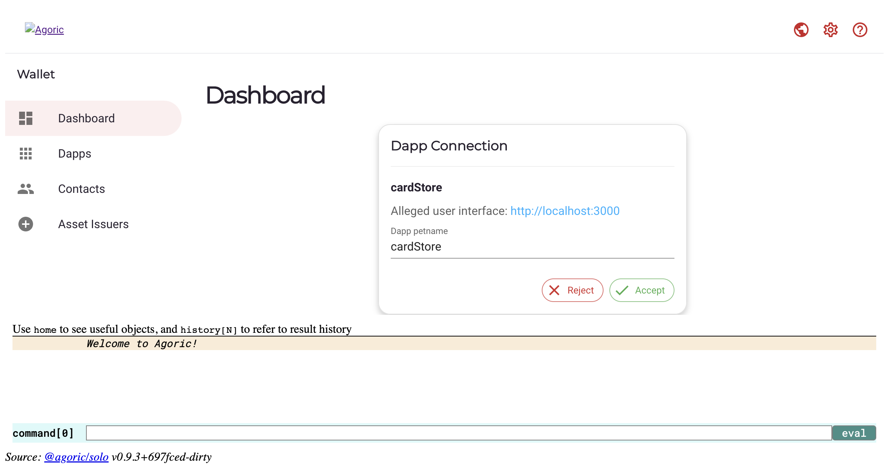
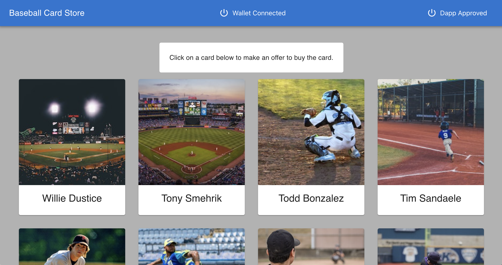

# Starting a Project

Before we begin, you should use `agoric --version` to double-check that you have [installed the Agoric SDK](./README.md).

If it is available, then you successfully installed the Agoric SDK. If not, then please do so before continuing. 

After you've [installed the Agoric SDK](./README.md), then you're ready for your first _Agoric Dapp_ (decentralized application) by continuing the instructions below. 

We'll be running **three terminal windows**. See below: 

 1. ```sh
    # Terminal 1: simulated blockchain and "solo" client
    ```
 2. ```sh secondary style2
    # Terminal 2: contract interaction
    ```
 3. ```sh secondary style3
    # Terminal 3: web user interface
    ```

::: tip Watch: Prepare Your Agoric Environment (November 2020)
This presentation includes starting a project, but note an outdated detail:

 - In the REPL `x~.go()` tildot support has been postponed; use `E(x).go()` instead.

<iframe width="560" height="315" src="https://www.youtube.com/embed/w0By22jYhJA" title="YouTube video player" frameborder="0" allow="accelerometer; autoplay; clipboard-write; encrypted-media; gyroscope; picture-in-picture" allowfullscreen></iframe>
:::

## Initialize the Default Dapp Template

The following section will explain how to initialize the default Dapp template, install the Agoric SDK
into the Dapp template, and then launch the Agoric Solo Client and Simulated Blockchain.

Use the [Agoric CLI](../agoric-cli/) to fetch from a Dapp template
and put it in a directory _not located in your `agoric-sdk` clone_. We named the directory "demo", but you can name the folder whatever you like.

```sh
# Terminal 1
# Don't use your agoric-sdk as the parent of the demo directory.
cd $HOME
agoric init --dapp-template dapp-card-store demo # use `agoric init --dapp-template dapp-card-store $DIRNAME` with any name you like
cd demo
agoric install community-dev # will take a minute to install all dependencies
agoric start --verbose --reset # `agoric start --reset` to start over
```

Learn more about the [available Dapp templates](../dapps/dapp-templates.md).

::: tip Mac Dev Tools
On a Mac, you must first install
[Xcode](https://apps.apple.com/us/app/xcode/id497799835)
:::

Leave this process and its logs running in its own terminal window.

## Open the Agoric Wallet and REPL

```sh secondary style2
# Terminal 2
cd demo
agoric open --repl
```

This should automatically open [http://127.0.0.1:8000](http://127.0.0.1:8000) in a new browser window or tab.

To begin using the wallet, click the "Connect Solo Wallet" button.


After your solo wallet is connected, then you're ready to deploy the contract and API. 

## Deploy the Contract and API

In our second terminal, deploy the contract to the simulated blockchain
and the API to the solo client.

```sh secondary style2
# Terminal 2
cd demo # if not already there
agoric deploy ./contract/deploy.js 
agoric deploy ./api/deploy.js
```

We'll cover [deploying smart contracts](./deploying.md)
in detail later.

## Start the Dapp User Interface

The web user interface communicates with the API in the solo client as well as the wallet.

```sh secondary style3
# Terminal 3
cd demo # if not already there
cd ui && yarn start
```

Leave this running in its own terminal window and visit [http://localhost:3000](http://localhost:3000) in a web browser.

## Connect the Dapp to the Agoric Wallet

1. Once here, you will be asked to enable the Dapp in your Agoric wallet.

::: tip Dapp Not Loading?

If this Dapp store UI message does not load after a few seconds, try refreshing the page.

:::


1. Navigate back to [http://127.0.0.1:8000](http://127.0.0.1:8000) and accept the Dapp's request to connect to your wallet.



2. Navigate back to [the Dapp](http://localhost:3000) and it should load the baseball cards to bid on



## Use the Dapp to bid on and buy a baseball card

1. In the Dapp, you should be able to click on a baseball card to `BID` on it in an action. Enter `Bid ammount` to submit an offer to buy the card.

   

1. In the wallet, `Approve` the `Proposed` offer to bid on a card.

   

1. In the wallet, the offer will be in a `Pending` state while the auction for the card to complete. The auction takes up to 300 seconds.

   

1. In the wallet, your offer will transition to an `Accepted` state when the auction ends. Your `cardStore.Card` purse will now contain a card.

   

Visit the [wallet UI](../wallet/ui.md#wallet-ui) documentation for more information.